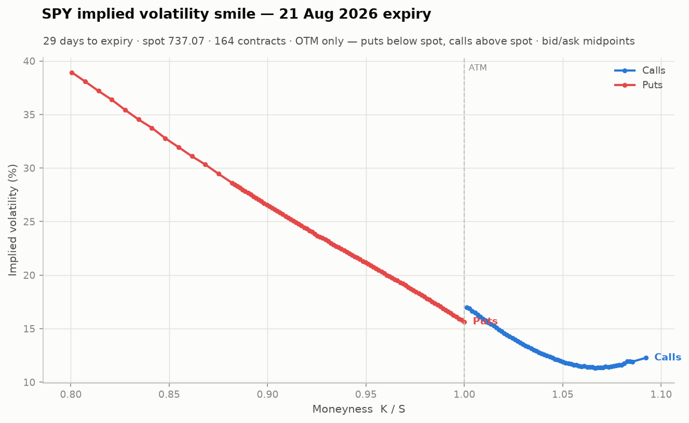
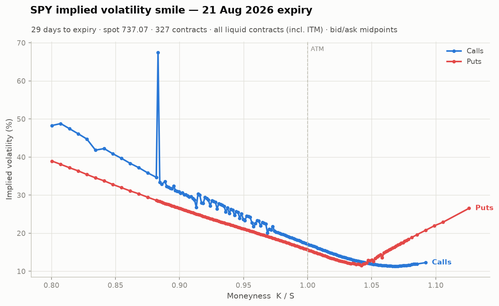
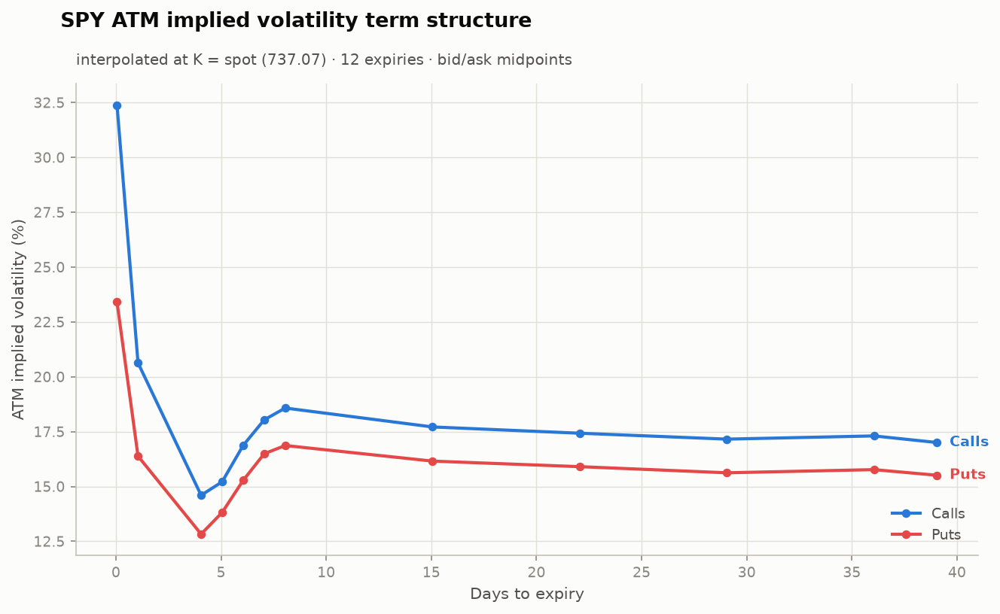
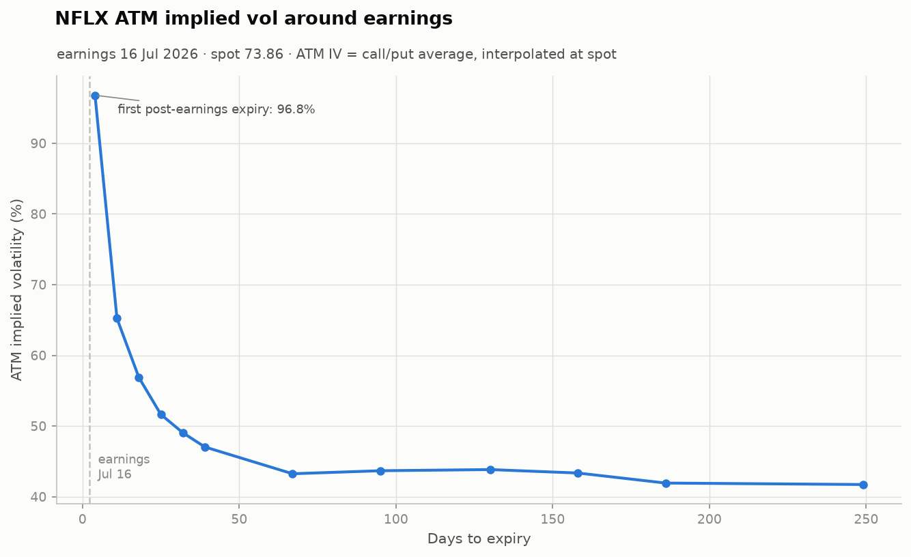
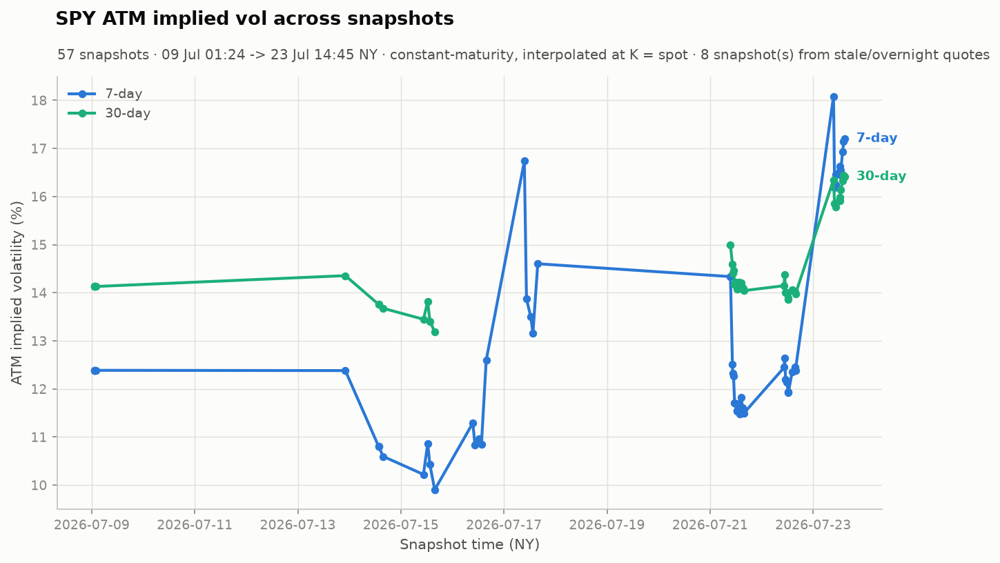

# Options Pricing & Implied Volatility Analysis

A from-scratch implementation of Black-Scholes pricing and implied volatility
analysis on real market data. No shortcut IV libraries — the pricing formula,
Greeks, and the Newton-Raphson/Brent root-finder are all implemented and
tested in this repo.

## Quickstart

```bash
python -m venv .venv && source .venv/bin/activate
pip install -r requirements.txt

python -m src.test_black_scholes   # unit tests vs textbook values
python -m src.main                 # full SPY pipeline -> outputs/*.png
python -m src.earnings_vol         # stretch: NFLX earnings vol premium
```

Or open `notebooks/analysis.ipynb` for the guided walkthrough.

```
run_pipeline.py        set-and-forget pipeline: snapshot + all charts, per ticker
src/black_scholes.py   Black-Scholes price + closed-form Greeks
src/implied_vol.py     Newton-Raphson IV solver with Brent fallback
src/data_fetch.py      yfinance option-chain pull, caching, liquidity filter,
                       timestamped snapshots (save_snapshot / load_snapshots)
src/scheduler.py       recurring snapshot puller (loop mode or cron one-shot)
src/plotting.py        smile, term-structure & snapshot-history charts
src/main.py            end-to-end pipeline
src/earnings_vol.py    earnings vol premium / implied move (stretch)
data/                  cached raw pulls + solved chains (CSV, one per day)
data/snapshots/        immutable timestamped pulls (CSV + JSON sidecar each)
outputs/               charts (PNG, stable filenames — see update policy below)
logs/pipeline.log      one line per pipeline stage: counts, convergence, failures
```

## Methodology

### 1. Pricing (Black-Scholes)

European call/put prices under geometric Brownian motion with constant vol,
rate `r` (13-week T-bill via `^IRX`, converted to continuous compounding) and
continuous dividend yield `q` (trailing-12-month dividends / spot). Closed-form
delta, gamma, vega, theta. Verified against textbook values (ATM 1y call at
S=K=100, r=5%, sigma=20% prices at 10.4506) and, more stringently, every Greek
is checked against a finite-difference derivative of the price function, and
put-call parity holds to machine precision.

### 2. Implied vol solver

`price -> sigma` has no closed form, but vega > 0 makes the map monotone, so a
unique root exists whenever the price is inside the no-arbitrage bounds.

1. **No-arbitrage pre-check** — a quote below intrinsic value (or above the
   discounted spot/strike) has *no* implied vol; return `None` immediately.
2. **Newton-Raphson** — `sigma <- sigma - (BS(sigma) - P) / vega(sigma)`,
   seeded with the Brenner-Subrahmanyam approximation `P/S * sqrt(2*pi/T)`.
   Quadratic convergence, typically 3-6 iterations.
3. **Brent fallback** — Newton fails where vega is tiny (deep ITM/OTM, or
   hours to expiry: the price barely responds to vol, so the Newton step
   explodes). Brent only needs a bracketing interval, so it is slow but
   nearly unbreakable. If even Brent cannot bracket a root in [0.01%, 500%],
   the contract is recorded as **failed** rather than given a garbage number.

Round-trip tests (price at a known sigma, invert, compare) recover vol to
~1e-15 in both the Newton and Brent regimes.

### 3. Data & liquidity filtering

- Underlying: **SPY**, 12 expiries (~1 day to ~1 month out at pull time).
- Market price: bid/ask **midpoint** during market hours. This snapshot was
  pulled overnight, when Yahoo clears its quotes (99% of contracts showed a
  zero bid) — the code detects this and falls back to **lastPrice** from the
  prior session, anchoring time-to-expiry to that session's 4pm ET close so
  short-dated IVs aren't biased by phantom hours.
- Liquidity filter: in midpoint mode, drop zero-bid contracts and spreads
  wider than 20% of mid; in lastPrice mode, require session volume >= 10.
- Raw pulls are cached to `data/` (one CSV per ticker per day) so runs are
  reproducible; the filter runs after loading and reports what it dropped.

<!-- AUTO:RESULTS_TABLE:START -->
## Results (latest snapshot: 2026-07-23 14:45 ET, SPY spot 737.07)

| Stage | Count |
|---|---|
| Contracts pulled (12 expiries) | 3,394 |
| Survive liquidity filter | 2,639 (78%) |
| IV solved via Newton | 1,724 (65%) |
| IV solved via Brent fallback | 798 (30%) |
| Failed (no root / outside bounds) | 117 (4.4%) |

Newton dominates, as expected when quotes are healthy and vega is meaningful across the chain; Brent mops up the deep wings and the shortest expiries.
The 117 failures cluster in the shortest expiries and deep-ITM strikes; 113 of them are quotes sitting below intrinsic value — prices that genuinely admit no implied vol, which the solver refuses rather than forcing a number.
<!-- AUTO:RESULTS_TABLE:END -->

<!-- AUTO:SMILE:START -->
### Why the smile exists



Under Black-Scholes assumptions the IV-vs-strike line would be flat. Instead SPY shows the classic **equity skew**: the 21 Aug 2026 expiry prices 16% at the money vs 27% for puts 10% below spot (+10.2 vol pts). Three standard explanations, all pushing the same direction:

- **Crash risk is priced.** Since October 1987, index option markets have never priced equity returns as lognormal — the true return distribution has a fat left tail, and OTM puts are priced accordingly.
- **The leverage effect.** When equity prices fall, leverage (D/E) mechanically rises and realized volatility goes up — so low-strike states genuinely are higher-vol states.
- **Demand for downside protection.** Institutions systematically buy index puts as insurance; dealers who sell them charge for the inventory risk.
<!-- AUTO:SMILE:END -->

<!-- AUTO:CALLS_PUTS:START -->
### Calls vs puts — where they diverge and why



Put-call parity says call IV and put IV should be identical at the same strike — but in this snapshot they differ by 1.5 vol points even at the money (17.2% calls vs 15.6% puts on the 21 Aug 2026 expiry), larger than parity should allow. The likely culprit is quote noise and wide ITM spreads; treat single-strike IV readings from this snapshot with caution. The structural ITM divergence is on top of that:

- An ITM option's price is nearly all intrinsic value; the vol information lives in a few cents of time value, and quote noise and wide ITM spreads can swing ITM implied vols enormously. (OTM prices are *pure* time value — much more informative per cent of noise.)
- SPY options are **American**-exercise while our model is European. The early-exercise premium is small but nonzero (larger for ITM puts, and around ex-dividend dates for calls), biasing ITM IVs up slightly.

This is why desks build vol surfaces from OTM puts below spot and OTM calls above spot — exactly what the OTM chart above does.
<!-- AUTO:CALLS_PUTS:END -->

<!-- AUTO:TERM_STRUCTURE:START -->
### Term structure



ATM IV currently averages 18.1% for expiries within a week vs 16.5% around one month: a **downward-sloping (backwardation)** curve — the market is pricing *more* volatility near-term than long-term. That is the stressed shape: either a known near-dated event (macro print, earnings cluster) or a recent vol spike that the market expects to mean-revert. Worth checking the calendar before reading it as generalized fear.

Short-end readings deserve suspicion in general: 1-2 day expiries are the noisiest numbers on the chart (tiny vega), and T is measured in **calendar** days, so an expiry spanning a weekend contains dead non-trading time that mechanically depresses its annualized IV. A trading-day clock would smooth this.
<!-- AUTO:TERM_STRUCTURE:END -->

<!-- AUTO:EARNINGS:START -->
### Stretch: earnings vol premium (NFLX)



No earnings inside the tracking window at the moment — the next report is 20 Oct 2026 (~89 days away); tracking resumes automatically inside the 60-day window. The chart shows the **archived analysis of the 16 Jul 2026 event**, rendered from numbers persisted at capture time (`data/earnings_archive_NFLX.json`), not recomputed:

- Final pre-print capture (16 Jul 15:45 ET): front-expiry ATM IV 213% (annualized — an entire earnings move packed into one day), implied move 11.0%.
- Post-print capture (17 Jul 15:45 ET): front expiry crushed to 38%.
- Realized next-day move **-6.7%** vs 11.0% implied — the market overpaid for the event, which is the whole vol-crush trade in one line.
<!-- AUTO:EARNINGS:END -->

## Tracking the smile over time (snapshots)

Every call to `save_snapshot("SPY")` writes an **immutable** timestamped pair
to `data/snapshots/` — raw chain CSV plus a JSON sidecar with the spot, spot
timestamp, pull timestamp, risk-free rate, dividend yield, and a stale-quotes
flag, so each snapshot is self-contained and reproducible:

```
spy_chain_2026-07-09_0124.csv         (filename clock = New York time)
spy_chain_2026-07-09_0124_meta.json
```

Old snapshots are never overwritten: same-minute collisions get a seconds
suffix, and a true collision raises instead of clobbering.

**Collecting on a cadence** — the recommended way is `run_pipeline.py`, which
refreshes data *and* charts together (next section). For data-only collection
the older options remain: `python -m src.scheduler --loop --every 30` or a
cron line on `python -m src.scheduler --once` (market-hours guarded).

## Set-and-forget pipeline

`run_pipeline.py` (project root) ties collection and charting together.
Per ticker (default `SPY NFLX`): take a new immutable snapshot → recompute
implied vols on it → refresh all charts. Two chart update policies:

- **Accumulating** — `atm_history_{TICKER}.png` is rebuilt from the *entire*
  snapshot archive, so every run appends one point to the constant-maturity
  ATM vol time series. Snapshot files are never modified.
- **Replacing** — `smile_{TICKER}.png`, `smile_otm_{TICKER}.png`,
  `term_structure_{TICKER}.png`, `earnings_{TICKER}.png` are regenerated from
  the latest snapshot only and overwritten in place: always exactly one
  current version, no dated pileup. The smile expiry is re-picked each run as
  the listed expiry nearest 30 days *from the snapshot's own timestamp* — the
  same anchor as every T in the IV solves, not the wall clock, so the choice
  stays consistent with the data even when charting a stale snapshot — and
  rolls forward automatically as new snapshots arrive.

The earnings chart has a lifecycle rather than a skip condition. **In
window** (report within 60 days ahead, or within a 3-day grace period after —
so the vol crush gets captured), every run redraws the full premium analysis
and persists its numbers (ATM curve, spot, implied move) to
`data/earnings_archive_{TICKER}.json` as a "pre" or "post" capture,
atomically, reset per event. **Out of window**, the chart is still rewritten
every run — as an explicit status view: "no upcoming report in tracking
window", the next report date and distance, and the archived last-completed
analysis re-rendered from the JSON (final pre-earnings curve vs post-earnings
crush, overlaid by expiry date, labeled ARCHIVED with implied vs realized
move). The chart never goes silently stale, and the log says which state it's
in ("earnings out of tracking window (next in 93d) — showing archived
analysis from 2026-07-16") instead of a skip line. For the July 2026 NFLX
event this captured: final pre-print front-expiry IV 213% (annualized, hours
before the report), implied move 11.0%, realized next-day move -6.7%, front
IV crushed to 38% a day later.

Every stage is individually wrapped: one ticker or chart failing is logged
(with traceback) to `logs/pipeline.log` and the rest of the run continues —
and charts still refresh from the archive even if the day's pull fails. Each
run logs contract counts, the liquidity-filter yield, IV convergence rate
(newton/brent/failed split), and stale-quote status.

Cron schedule (`crontab -e`) — US market open, midday, and near close on
weekdays. Times are in the machine's local clock (here: Hong Kong, UTC+8);
each slot has two entries so the schedule survives US daylight-saving
changes — the market-hours guard turns whichever twin lands outside
9:30–16:00 ET into a no-snapshot chart refresh, and the in-hours extras just
add snapshots:

```cron
# open (9:30 ET)        midday (12:30 ET)      near close (15:45 ET)
30 21 * * 1-5 cd "/path/to/options-vol-project" && .venv/bin/python run_pipeline.py >> logs/cron.log 2>&1
30 22 * * 1-5 cd "/path/to/options-vol-project" && .venv/bin/python run_pipeline.py >> logs/cron.log 2>&1
30 0  * * 2-6 cd "/path/to/options-vol-project" && .venv/bin/python run_pipeline.py >> logs/cron.log 2>&1
30 1  * * 2-6 cd "/path/to/options-vol-project" && .venv/bin/python run_pipeline.py >> logs/cron.log 2>&1
45 3  * * 2-6 cd "/path/to/options-vol-project" && .venv/bin/python run_pipeline.py >> logs/cron.log 2>&1
45 4  * * 2-6 cd "/path/to/options-vol-project" && .venv/bin/python run_pipeline.py >> logs/cron.log 2>&1
```

(Midday/close slots use `2-6` = Tue–Sat local because those ET times fall
after midnight Hong Kong time.) macOS caveats: cron doesn't fire while the
laptop sleeps (no catch-up), and macOS privacy protection can block cron from
reading `~/Desktop` — if `logs/cron.log` shows "Operation not permitted",
grant `/usr/sbin/cron` Full Disk Access in System Settings, or move the
project out of Desktop. US exchange holidays aren't modeled; a holiday run
just logs a skipped snapshot.

**Analysis** — `load_snapshots("SPY")` combines every snapshot into one
DataFrame indexed by pull time, and `atm_iv_history` + `plot_atm_history`
turn it into a **constant-maturity** ATM vol time series (IV interpolated at
K = spot per expiry, then across expiries at fixed 7- and 30-day tenors, so
the series doesn't jump when the front expiry rolls off — the same idea as
the VIX's 30-day interpolation):



The chart above was seeded with three overnight snapshots minutes apart —
identical prior-session prices, hence flat lines (the subtitle flags them as
stale-quote snapshots). It becomes a real vol monitor as market-hours
snapshots accumulate: expect the 7-day line to swing harder than the 30-day
(short-dated vol is the twitchier end of the curve), and both to jump on
macro prints.

<!-- AUTO:DATA_QUALITY:START -->
## Data-quality caveats (observed, not hypothetical)

- **This snapshot uses live bid/ask midpoints** (market-hours pull): 468 zero-bid contracts dropped and 287 more for spreads wider than 20% of mid.
- **yfinance's own `impliedVolatility` column** has been observed returning garbage (~1e-5) on overnight pulls — one reason this project solves for IV itself rather than trusting vendor fields.
- **4.4% of IV solves failed** (117 contracts, mostly the shortest expiries and deep-ITM strikes); 113 were prices below intrinsic value — quotes that genuinely admit no implied vol.
- **American vs European**: SPY/NFLX options are American; all IVs here carry a small upward bias from the unmodeled early-exercise premium.
- **Discrete dividends** are approximated by a continuous yield (SPY q ~ 1.26% trailing); fine at this horizon, cruder for long-dated options.
<!-- AUTO:DATA_QUALITY:END -->

## Limitations / next steps

- Binomial-tree (CRR) pricer to quantify the American premium directly.
- Trading-day (business-day) time convention to remove the weekend artifact.
- Second earnings snapshot post-print to plot the realized vol crush.
- Fit a parametric smile (e.g. SVI) instead of linear interpolation at ATM.
